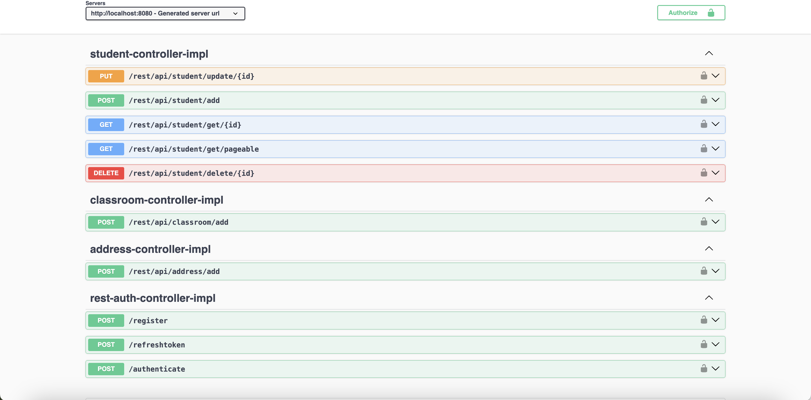

# 🎓 Student Management System Backend API

This project is a robust **Spring Boot** based RESTful API service developed to manage student records, classroom assignments, and address details. It ensures data consistency and provides a secure environment for user authorization.

Built with **Java 21** and **Spring Boot 4**, it leverages a modern, secure, and scalable architecture.

## 🚀 Features

* **🔐 Authentication & Authorization:** Secure login, registration, and token refresh mechanism using **JWT (JSON Web Token)**.
* **📚 Student Management:** Full CRUD operations for students, including pagination and sorting capabilities.
* **🏫 Class & Address Management:** Relational database handling for assigning classes and addresses to students.
* **🛡️ Security:** End-to-end protected endpoints integrated with **Spring Security**.
* **⚠️ Global Exception Handling:** A centralized exception handling mechanism that returns standardized, readable JSON error responses (401, 403, 404, etc.) to the client.
* **📖 Documentation:** Automatic and interactive API documentation with **Swagger UI (OpenAPI 3)**.

## 🛠️ Tech Stack

The project is built upon the latest technologies and libraries:

| Technology | Version / Details | Description |
| :--- | :--- | :--- |
| **Java** | `JDK 21` | Programming Language (LTS) |
| **Framework** | `Spring Boot 4.0.1` | Backend Framework |
| **Database** | `PostgreSQL` | Relational Database |
| **ORM** | `Spring Data JPA` | Hibernate-based Data Access |
| **Security** | `Spring Security` | Authentication & Authorization |
| **Token** | `JJWT (0.11.5)` | JSON Web Token Creation/Validation |
| **Docs**| `SpringDoc OpenAPI` | Swagger UI Interface |
| **Tools** | `Lombok`, `Maven` | Boilerplate reduction & Dependency Management |


## 📖 API Documentation (Swagger)

Once the application is running, you can access the interactive API documentation to test endpoints and view data models:


*(Swagger Interface Screenshot)*

## 📡 Sample Requests & Responses

### 1. Successful Login (200 OK)
**POST** `/rest/api/auth/authenticate`

```json
{
  "result": true,
  "data": {
      "accessToken": "eyJhbGciOiJIUzI1NiJ9.eyJzdWIiOiJhZG1pbiIsIm...",
      "refreshToken": "eyJhbGciOiJIUzI1NiJ9.eyJzdWIiOiJhZG1pbiIsIm..."
  },
  "errorMessage": null
}
```
### 2. Get (200 OK)
**POST** `/rest/api/student/get/24`

```json
{
    "result": true,
    "errorMessage": null,
    "data": {
        "id": 24,
        "firstName": "Fatih",
        "lastName": "Sengun",
        "tckn": "11199988833",
        "address": {
            "id": 13,
            "description": "Istanbul"
        },
        "classroom": {
            "id": 1,
            "classroomName": "10-A"
        }
    }
}
```


### 3. Standardized Error Response (401/403 etc.)
Even errors caught by the Spring Security filter chain (Missing Token, Insufficient Permissions) return a consistent JSON format:

```json
{
    "result": false,
    "errorMessage": {
        "exception": {
            "createTime": "2026-01-06T14:54:14.482Z",
            "hostName": "Server-1",
            "message": "Access Denied / Unauthorized",
            "path": "uri=/rest/api/student/add"
        },
        "status": 401
    },
    "data": null
}
```

## 🔐 Security Configuration

The project utilizes the latest **Lambda DSL** style for Spring Security 6.1+. Custom `AuthenticationEntryPoint` and `AccessDeniedHandler` are implemented to ensure all security exceptions return the standardized JSON format.

```java
	private static final String AUTHENTICATE = "/authenticate";
	private static final String REGISTER = "/register";
	private static final String REFRESH_TOKEN="/refreshtoken";
	private static final String[] SWAGGER_PATHS= {
			"/swagger-ui/**",
			"/v3/api-docs/**",
			"/swagger-ui.html"
	};
	
	@Bean
	public SecurityFilterChain filterChain(HttpSecurity http) {
		http.csrf(csrf -> csrf.disable())
		.httpBasic(httpBasic->httpBasic.authenticationEntryPoint(authEntryPoint))
		.authorizeHttpRequests(request -> 
		request.requestMatchers(REFRESH_TOKEN,AUTHENTICATE,REGISTER)
		.permitAll()
		.requestMatchers(SWAGGER_PATHS)
		.permitAll()
		.anyRequest()
		.authenticated())
		.exceptionHandling(exception -> exception.authenticationEntryPoint(authTokenEntryPoint)
				.accessDeniedHandler(accessHandler))
		.sessionManagement(session -> session.sessionCreationPolicy(SessionCreationPolicy.STATELESS))
		.authenticationProvider(authenticationProvider)
		.addFilterBefore(jwtAuthenticationFilter, UsernamePasswordAuthenticationFilter.class);
		
		return http.build();
	}
```


---
Developed with ❤️ using Java 21 & Spring Boot.
